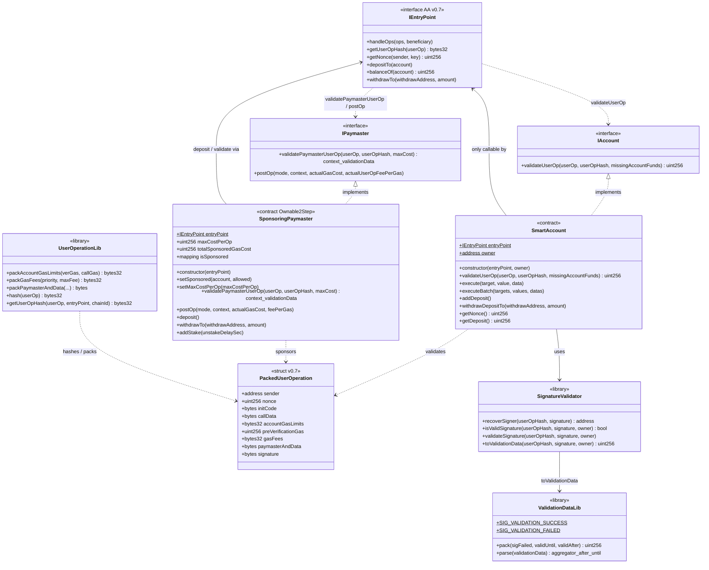

# Class diagram — Account Abstraction (ERC-4337)

[🇪🇸 Español](./diagrama-de-clases-ES.md) · 🇬🇧 English

Structural view of contracts, interfaces and relationships (module 12, **final v1**).

## Diagram (Mermaid)

---

## Key relationships

| Relationship | Type | Note |
|--------------|------|------|
| `SmartAccount` → `IAccount` | implementation | ERC-4337 v0.7 account |
| `SponsoringPaymaster` → `IPaymaster` | implementation | Gas sponsorship |
| Account / Paymaster → `IEntryPoint` | auth + deps | Only the EntryPoint invokes validate/execute/postOp |
| `SmartAccount` → `SignatureValidator` | library | ECDSA over `userOpHash` |
| `UserOperationLib` → EntryPoint hash | compatibility | `getUserOpHash` ≡ EP |

---

## Design notes (v1)

- `entryPoint` and `owner` (account) / `entryPoint` (PM) are **immutable**.
- Spec: **ERC-4337 v0.7** — `PackedUserOperation`.
- `SignatureValidator` is a **library** (stateless).
- Errors: `OnlyEntryPoint`, `ExecutionFailed`, `InvalidUserOpSignature`, `PaymasterValidationFailed`, `ZeroAddress`, `InvalidBatchLength`.
- Paymaster admin: OpenZeppelin `Ownable2Step`.
