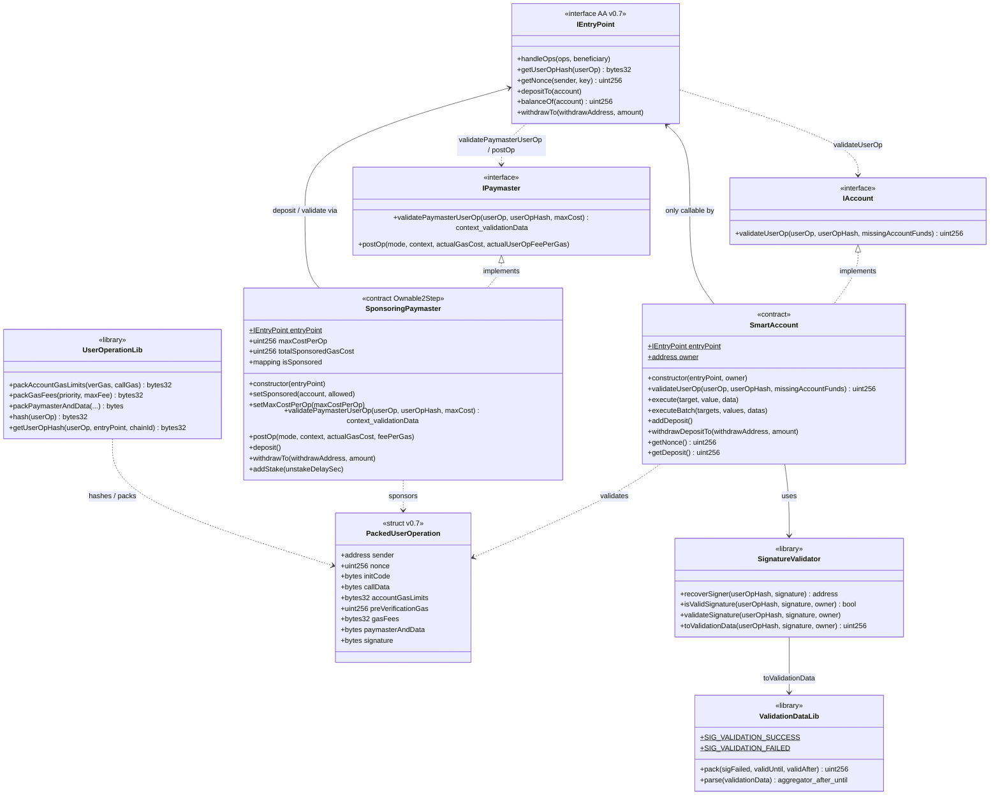

# Diagrama de clases — Account Abstraction (ERC-4337)

🇪🇸 Español · [🇬🇧 English](./diagrama-de-clases-EN.md)

Vista estructural de contratos, interfaces y relaciones (módulo 12, **v1 final**).

## Diagrama (Mermaid)

---

## Relaciones clave

| Relación | Tipo | Nota |
|----------|------|------|
| `SmartAccount` → `IAccount` | implementación | Cuenta ERC-4337 v0.7 |
| `SponsoringPaymaster` → `IPaymaster` | implementación | Patrocinio de gas |
| Account / Paymaster → `IEntryPoint` | auth + deps | Solo EntryPoint invoca validate/execute/postOp |
| `SmartAccount` → `SignatureValidator` | library | ECDSA sobre `userOpHash` |
| `UserOperationLib` → EntryPoint hash | compatibilidad | `getUserOpHash` ≡ EP |

---

## Notas de diseño (v1)

- `entryPoint` y `owner` (cuenta) / `entryPoint` (PM) son **immutable**.
- Spec: **ERC-4337 v0.7** — `PackedUserOperation`.
- `SignatureValidator` es **library** (sin estado).
- Errores: `OnlyEntryPoint`, `ExecutionFailed`, `InvalidUserOpSignature`, `PaymasterValidationFailed`, `ZeroAddress`, `InvalidBatchLength`.
- Paymaster admin: OpenZeppelin `Ownable2Step`.
