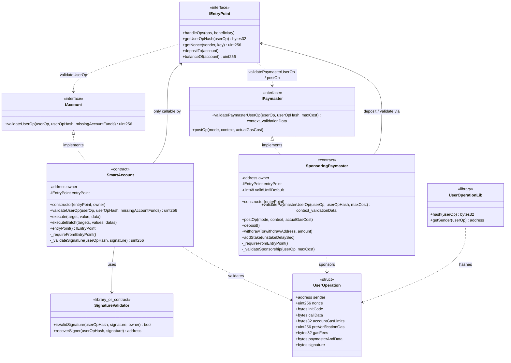

# Diagrama de clases — Account Abstraction (ERC-4337)

Vista estructural de contratos, interfaces y relaciones (módulo 12).

## Diagrama (Mermaid)

---

## Relaciones clave

| Relación | Tipo | Nota |
|----------|------|------|
| `SmartAccount` → `IAccount` | implementación | Contrato de cuenta ERC-4337 |
| `SponsoringPaymaster` → `IPaymaster` | implementación | Patrocinio de gas |
| `SmartAccount` / `Paymaster` → `IEntryPoint` | dependencia + auth | Solo EntryPoint puede invocar validación/ejecución/`postOp` |
| `SmartAccount` → `SignatureValidator` | uso | ECDSA sobre `userOpHash` |
| `IEntryPoint` → Account / Paymaster | orquestación | `handleOps` dispara el ciclo completo |

---

## Notas de diseño

- `entryPoint` y (si aplica) `owner` iniciales como `immutable` / set-once para gas y seguridad.
- La forma exacta del struct (`UserOperation` vs `PackedUserOperation`) se fija en **Fase 0/1** según la versión ERC-4337 elegida.
- `SignatureValidator` puede ser library pura o contrato helper; preferir library si no necesita estado.
- Errores del módulo: `OnlyEntryPoint`, `ExecutionFailed`, `InvalidUserOpSignature`, `PaymasterValidationFailed`.
