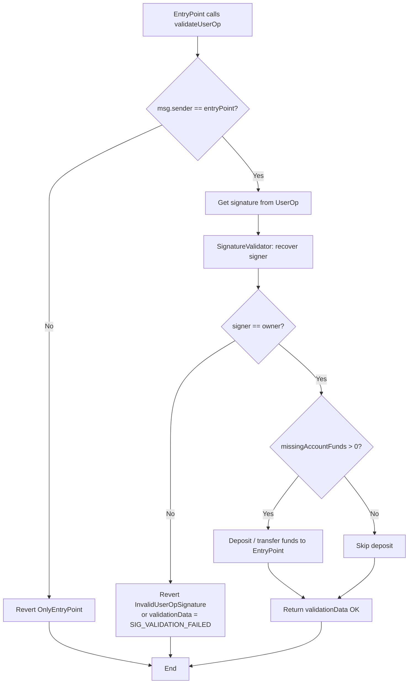
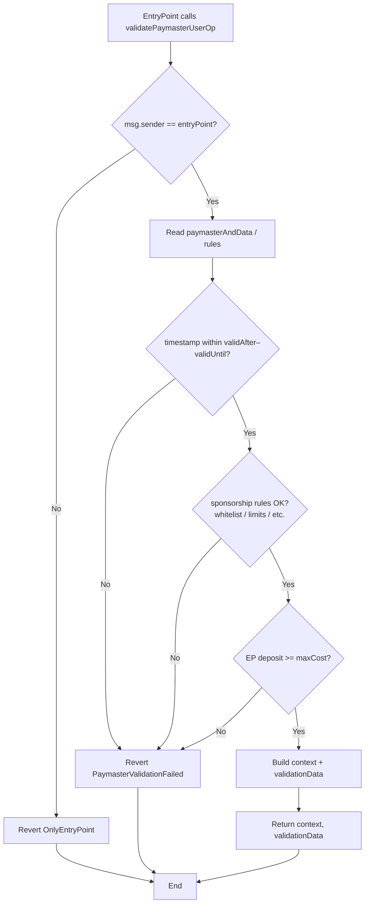
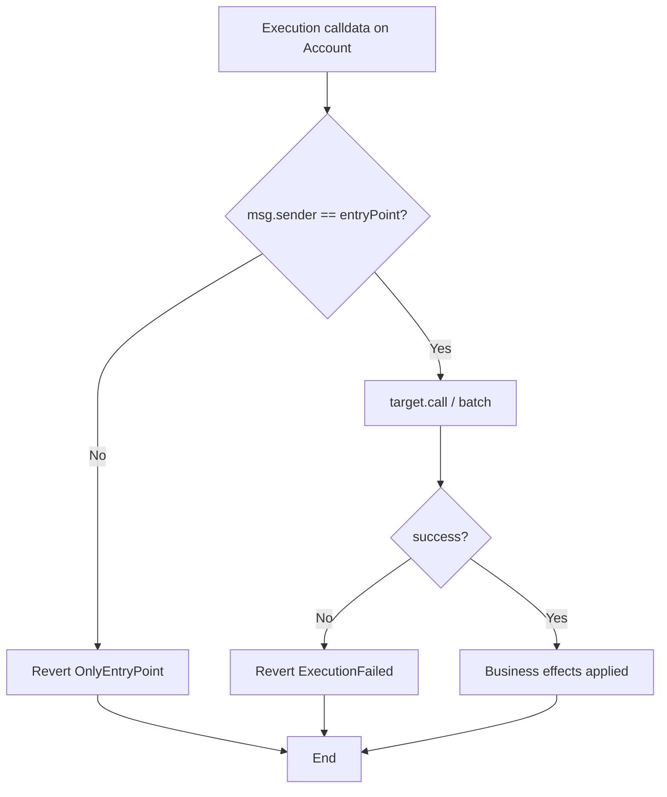
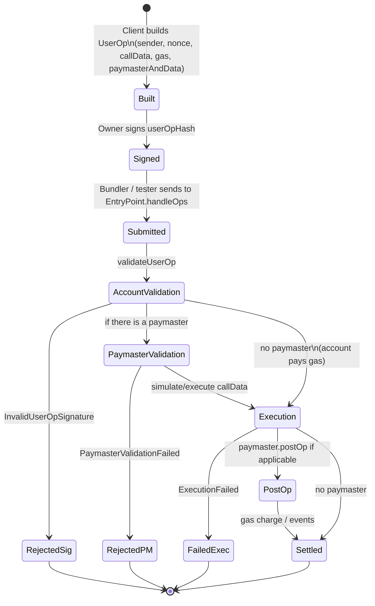
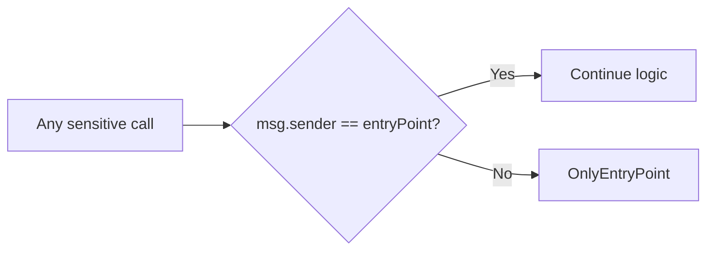

# Flow diagram — Validation, Paymaster and execution

[🇪🇸 Español](./diagrama-de-flujo-ES.md) · 🇬🇧 English

Internal decision flows of the Account Abstraction system (module 12, **final v1**).

## 1. `validateUserOp` in SmartAccount

## 2. `validatePaymasterUserOp`

## 3. Execution (`execute` / `executeBatch`)

## 4. State cycle — UserOperation

## 5. EntryPoint authorization (cross-cutting rule)

Applies to: `validateUserOp`, `execute`/`executeBatch`, `withdrawDepositTo`, `validatePaymasterUserOp`, `postOp`.
