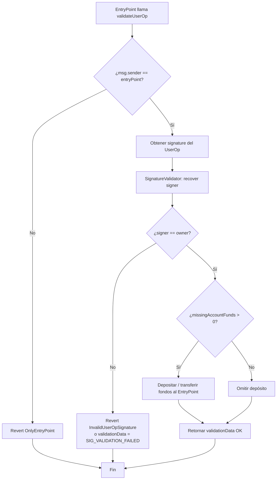
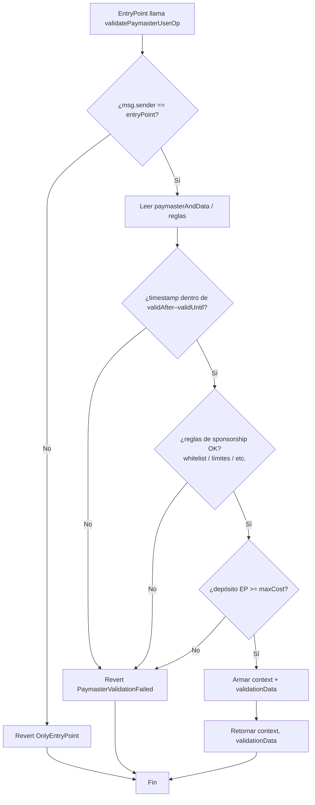
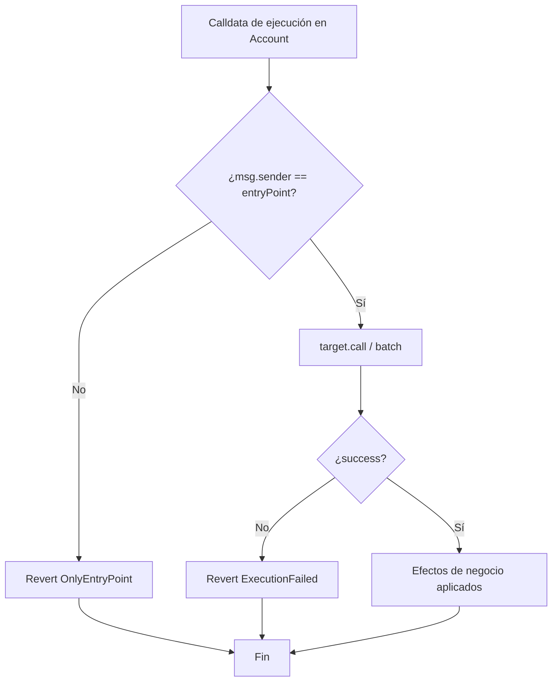
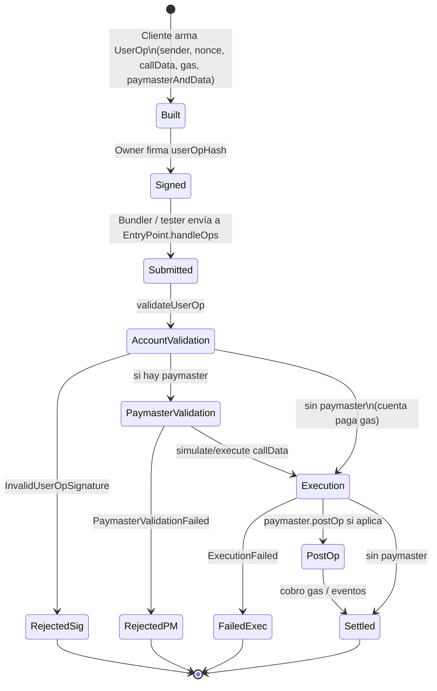
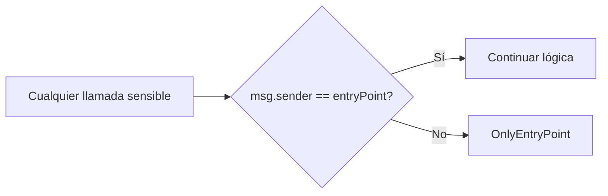

# Diagrama de flujo — Validación, Paymaster y ejecución

Flujos de decisión internos del sistema Account Abstraction (módulo 12).

## 1. `validateUserOp` en SmartAccount

## 2. `validatePaymasterUserOp`

## 3. Ejecución (`execute` / `executeBatch`)

## 4. Ciclo de estados — UserOperation

## 5. Autorización EntryPoint (regla transversal)

Aplica a: `validateUserOp`, `execute`/`executeBatch`, `validatePaymasterUserOp`, `postOp`.
