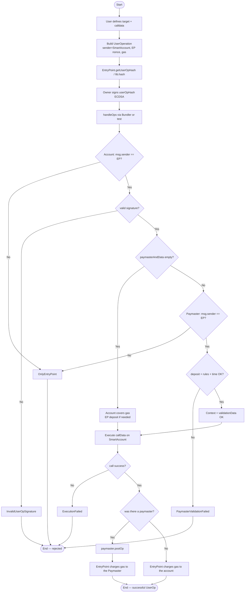
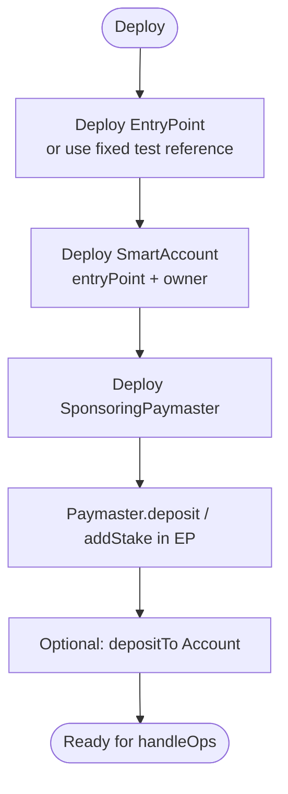
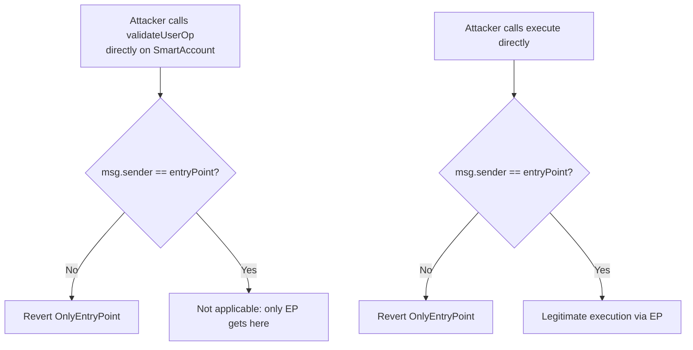
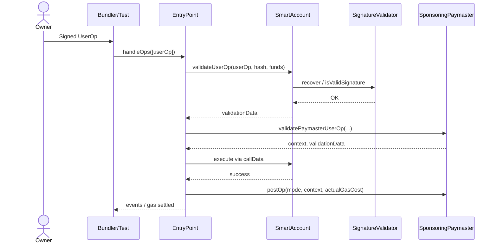

# Flowchart — Full ERC-4337 cycle (Account + Paymaster)

[🇪🇸 Español](./flujograma-ES.md) · 🇬🇧 English

End-to-end flow between actors and contracts (module 12, **final v1**): UserOp construction, signing, validation, execution and gas settlement.

## Actors

| Actor | Role |
|-------|------|
| Owner | Controls the Smart Account; signs the `userOpHash` |
| User / dApp | Defines the intent (target + calldata) |
| Bundler / Tester | Packs and sends `handleOps` to the EntryPoint (in tests: Foundry) |
| EntryPoint | Orchestrates validation, execution and gas charging |
| SmartAccount | Validates the signature and executes calls |
| SponsoringPaymaster | Sponsors gas if the rules pass |
| SignatureValidator | Recovers and verifies ECDSA |
| CI / Foundry | Unit, unauthorized, fuzz, gas profiling |

---

## Main flowchart — Build → Sign → Validate → Execute → Settle

---

## Flowchart — Deploy and funding

---

## Flowchart — Unauthorized sender (attack / misuse)

---

## Simplified sequence (happy e2e with Paymaster)

---

## Traceability with phases

| Flowchart segment | Phase | Status |
|-------------------|-------|--------|
| EP setup + folders + deps | 0 | ✅ |
| UserOp struct + hash + interfaces | 1 | ✅ |
| ECDSA signature | 2 | ✅ |
| Account validate + execute | 3 | ✅ |
| Paymaster validate + postOp + deposit | 4 | ✅ |
| E2E + unauthorized + fuzz | 5 | ✅ |
| Gas vs EOA + Deploy + SWC | 6 | ✅ |

**Module v1 complete.**
