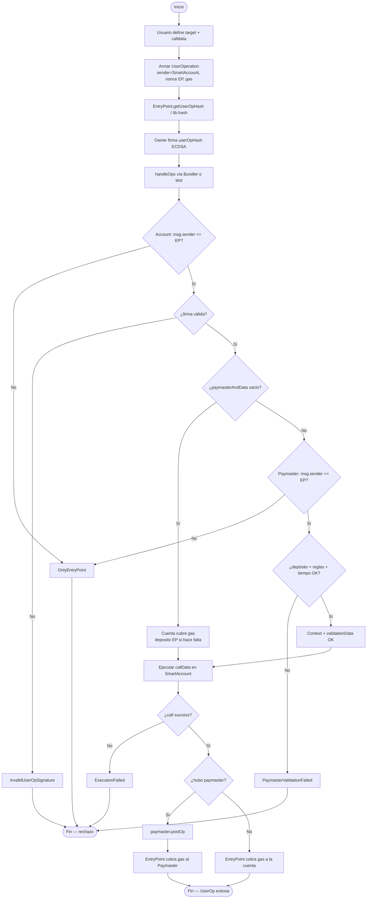
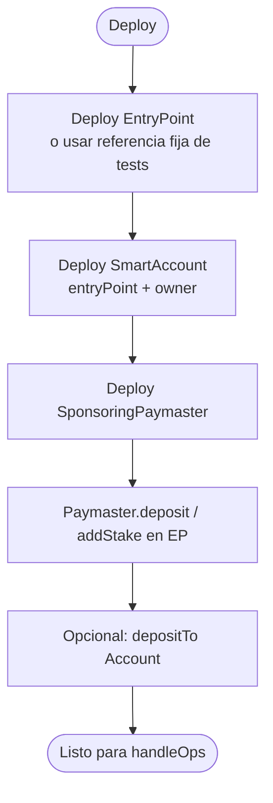
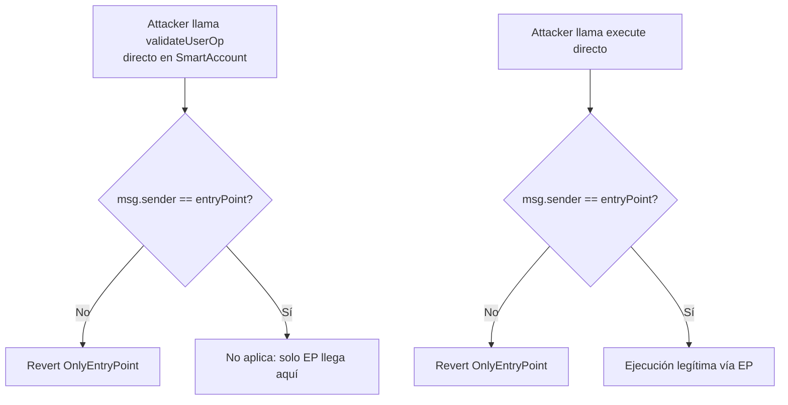
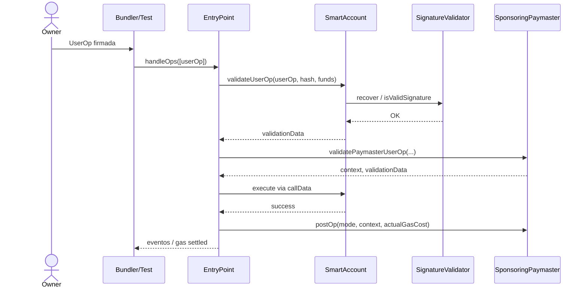

# Flujograma — Ciclo completo ERC-4337 (Account + Paymaster)

🇪🇸 Español · [🇬🇧 English](./flujograma-EN.md)

Flujo extremo a extremo entre actores y contratos (módulo 12, **v1 final**): construcción de UserOp, firma, validación, ejecución y liquidación de gas.

## Actores

| Actor | Rol |
|-------|-----|
| Owner | Controla la Smart Account; firma el `userOpHash` |
| Usuario / dApp | Define la intención (target + calldata) |
| Bundler / Tester | Empaqueta y envía `handleOps` al EntryPoint (en tests: Foundry) |
| EntryPoint | Orquesta validación, ejecución y cobro de gas |
| SmartAccount | Valida firma y ejecuta llamadas |
| SponsoringPaymaster | Patrocina gas si las reglas pasan |
| SignatureValidator | Recupera y verifica ECDSA |
| CI / Foundry | Unit, unauthorized, fuzz, gas profiling |

---

## Flujograma principal — Build → Sign → Validate → Execute → Settle

---

## Flujograma — Deploy y funding

---

## Flujograma — Unauthorized sender (ataque / misuse)

---

## Secuencia simplificada (e2e feliz con Paymaster)

---

## Trazabilidad con fases

| Tramo del flujograma | Fase | Estado |
|----------------------|------|--------|
| Setup EP + carpetas + deps | 0 | ✅ |
| Struct UserOp + hash + interfaces | 1 | ✅ |
| Firma ECDSA | 2 | ✅ |
| Account validate + execute | 3 | ✅ |
| Paymaster validate + postOp + deposit | 4 | ✅ |
| E2E + unauthorized + fuzz | 5 | ✅ |
| Gas vs EOA + Deploy + SWC | 6 | ✅ |

**Módulo v1 completo.**
